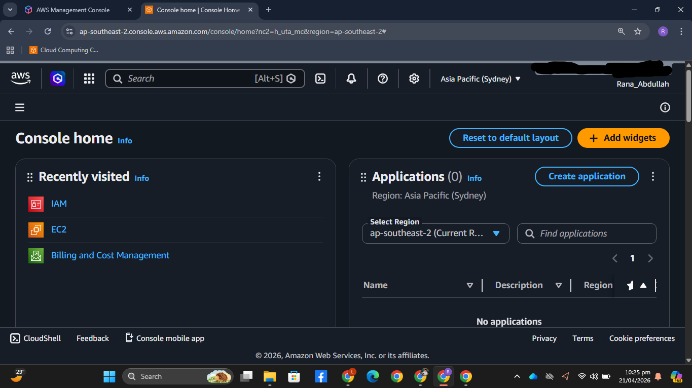
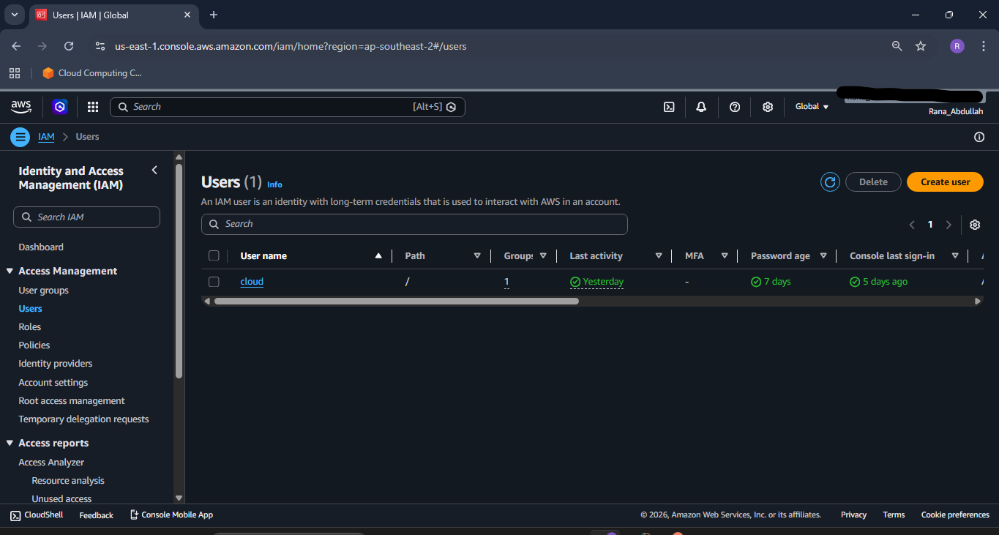
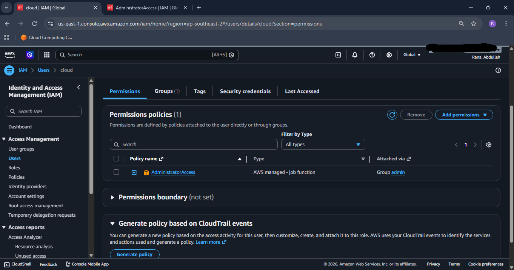
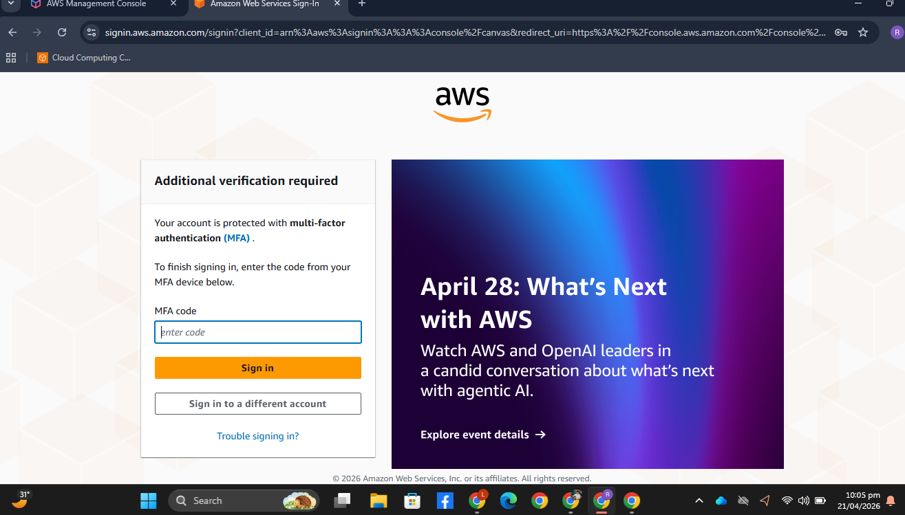

# 🔐 AWS IAM Security Setup

🚀 Demonstrates secure AWS IAM configuration using real AWS Console

✔ Secure IAM users & roles  
✔ Administrator access configured  
✔ AWS best practices followed (MFA enabled, no root access keys)

---

## 📸 Screenshots

### Console Dashboard

### IAM Users

### User Permissions

### MFA Verification

---

## ⚡ What I Did

* Created IAM user (`cloud`)
* Assigned **AdministratorAccess** policy
* Added user to admin group
* Enabled MFA (Multi-Factor Authentication)
* Verified secure AWS access setup

---

## 🛠️ Tools & Services

* AWS IAM
* AWS Console

---

## ✅ Result

* Secure AWS account setup
* Proper role-based access control
* Multi-layer security with MFA
* Production-ready IAM configuration

---
